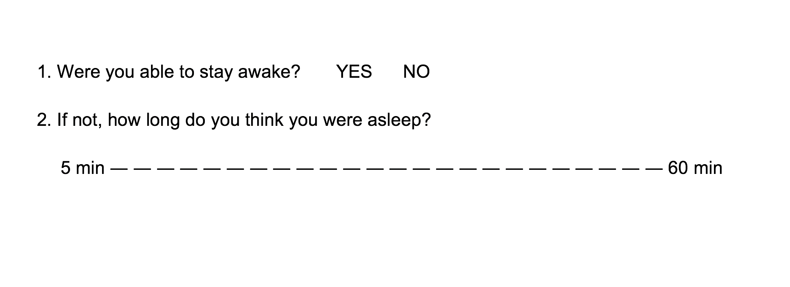
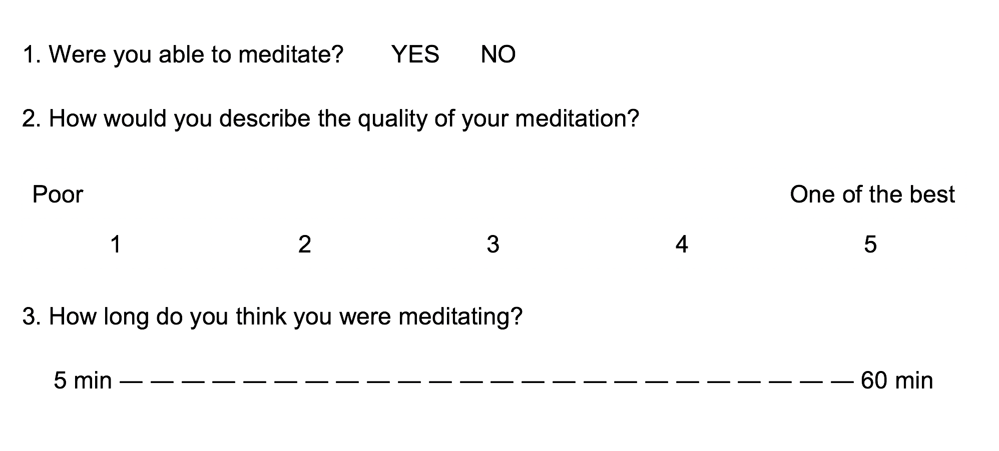
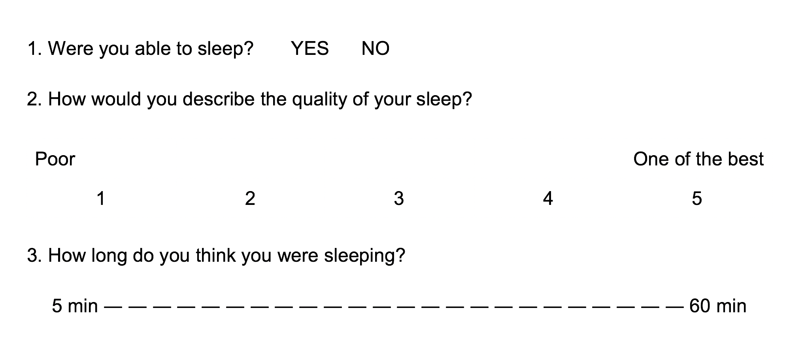
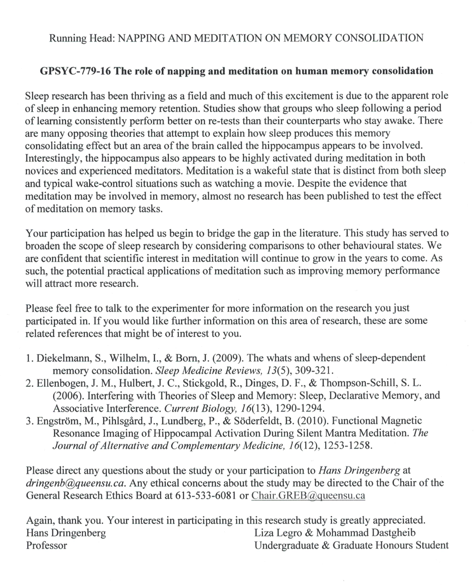

#Appendix A.
```{r, fig.cap = "Poster of the study. \\label{poster}", out.width="70%", fig.align="center", echo=FALSE}

```
\newpage
#Appendix B.
```{r, fig.cap = "General Research Ethics Board approval of the study.", out.width="70%", fig.align="center", echo=FALSE}
knitr::include_graphics('Appendix/Ethics_approval.pdf')
```
\newpage
#Appendix C.
```{r, out.width="95%", fig.align="center", echo=FALSE}
knitr::include_graphics('Appendix/Consent_pg1.pdf')
```
##Appendix C. cont.
```{r, out.width="95%", fig.align="center", echo=FALSE}
knitr::include_graphics('Appendix/Consent_pg2.pdf')
```
##Appendix C. cont.
```{r, fig.cap = "Letter of information and consent form for data collection and protection.", out.width="90%", fig.align="center", echo=FALSE}
knitr::include_graphics('Appendix/Consent_pg3.pdf')
```
\newpage
#Appendix D.
```{r, out.width="95%", fig.align="center", echo=FALSE}
knitr::include_graphics('Appendix/Participant_information_survey_pg1.pdf')
```
##Appendix D. cont.
```{r, fig.cap = "Participant Information Survey.", out.width="90%", fig.align="center", echo=FALSE}
knitr::include_graphics('Appendix/Participant_information_survey_pg2.pdf')
```
\newpage
#Appendix E.
```{r, fig.cap = "Freiburg Mindfulness Inventory.", out.width="90%", fig.align="center", echo=FALSE}
knitr::include_graphics('Appendix/Freiburg_Mindfulness_Inventory.pdf')
```
\newpage
#Appendix F.
```{r, fig.cap = "Self-report Questionaire for the wake condition.", out.width="90%", fig.align="center", echo=FALSE}

```
\newpage
#Appendix G.
```{r, fig.cap = "Self-report Questionaire for the meditation condition.", out.width="90%", fig.align="center", echo=FALSE}

```
\newpage
#Appendix H.
```{r, fig.cap = "Self-report Questionaire for the sleep condition.", out.width="90%", fig.align="center", echo=FALSE}

```
\newpage
#Appendix I.
```{r, fig.cap = "Epworth Sleepiness Scale.", out.width="90%", fig.align="center", echo=FALSE}
knitr::include_graphics('Appendix/Epworth.pdf')
```
\newpage
#Appendix J.
```{r, fig.cap = "Debriefing and explanation of the study.", out.width="90%", fig.align="center", echo=FALSE}

```
\newpage
#Appendix K.

## Frequentist report

### Declarative memory

The overall model predicting GMean `(formula = GMean ~ 1 + as.factor(Condition))` explains 7.64% of the variance of the endogen (adj. R^2^ = 4.61). The model's intercept is at 0.80 (SE = 0.025, 95% CI [0.76, 0.85]).

Within this model:
   - The effect of as.factor(Condition)NAP is not significant (beta = -0.026, SE = 0.033, 95% CI [-0.093, 0.040], t = -0.79, p > .1) and can be considered as small (std. beta = -0.23, std. SE = 0.29).
   - The effect of as.factor(Condition)WAKE is significant (beta = -0.080, SE = 0.036, 95% CI [-0.15, -0.0078], t = -2.22, p < .05) and can be considered as medium (std. beta = -0.70, std. SE = 0.31).

### Non-declarative memory

#### non-SWS

The overall model predicting MedianScores `(formula = MedianScores ~ Condition + (1 | Code))` has an total explanatory power (conditional R^2^) of 59.98%, in which the fixed effects explain 4.50% of the variance (marginal R2). The model's intercept is at 5.53 (SE = 0.55, 95% CI [4.46, 6.60]).

Within this model:
   - The effect of ConditionNAP is not significant (beta = -0.63, SE = 0.93, 95% CI [-2.42, 1.17], t(43) = -0.68, p > .1) and can be considered as small (std. beta = -0.24, std. SE = 0.35).
   - The effect of ConditionWAKE is not significant (beta = -1.29, SE = 0.78, 95% CI [-2.81, 0.23], t(43) = -1.65, p > .1) and can be considered as small (std. beta = -0.49, std. SE = 0.30).

#### SWS

The overall model predicting MedianScores `(formula = MedianScores ~ Condition + (1 | Code))` has an total explanatory power (conditional R^2^) of 67.51%, in which the fixed effects explain 6.22% of the variance (marginal R2). The model's intercept is at 5.53 (SE = 0.51, 95% CI [4.54, 6.52]).

Within this model:
   - The effect of ConditionNAP is not significant (beta = -1.24, SE = 0.77, 95% CI [-2.74, 0.25], t(47) = -1.61, p > .1) and can be considered as medium (std. beta = -0.52, std. SE = 0.32).
   - The effect of ConditionWAKE is significant (beta = -1.29, SE = 0.72, 95% CI [-2.69, 0.11], t(47) = -1.79, p = 0.08) and can be considered as medium (std. beta = -0.54, std. SE = 0.30).

\newpage
#Appendix L.

**Central Posterior Uncertainty Intervals**

## Declarative memory

```{r, fig.cap = "Central Posterior Uncertainty Intervals of the Declarative memory model.", out.width="90%", fig.align="center", echo=FALSE}
knitr::include_graphics('Appendix/CPI_Decl.pdf')
```
\newpage
#Appendix L. cont.

## Non-declarative memory

**Central Posterior Uncertainty Intervals**
```{r, fig.cap = "Central Posterior Uncertainty Intervals of the Non-declarative memory model, non-SWS.", out.width="60%", fig.align="center", echo=FALSE}
knitr::include_graphics('Appendix/PCI_NONDECL_nonSWS.pdf')
```

```{r, fig.cap = "Central Posterior Uncertainty Intervals of the Non-declarative memory model, SWS.", out.width="60%", fig.align="center", echo=FALSE}
knitr::include_graphics('Appendix/CPI_NONDECL_SWS.pdf')
```
\newpage
#Appendix M.
## The interaction of gender in non-SWS subset of nappers on non-declarative memory task

I fitted a Markov Chain Monte Carlo gaussian (link = identity) model `(4 chains, each with iter = 2000; warmup = 1000; thin = 1; post-warmup = 1000)` to predict Median Scores `(formula = scale(MedianScores) ~ Condition * Gender + (1 | Code))`. The model's priors were set as follows: ~ normal (location = (0, 0, 0, 0, 0), scale = (0.50, 0.50, 0.50, 0.50, 0.50))

The model has an explanatory power (R^2^) of about 60.06% (MAD = 0.077, 90% CI [0.47, 0.72], adj. R^2^ = 0.24). The intercept is at -0.086 (MAD = 0.20, 90% CI [-0.40, 0.24]). Within this model:

  - The effect of stage 1 and 2 sleep has a probability of 74.98% of being negative (Median = -0.19, MAD = 0.28, 90% CI [-0.65, 0.28], Overlap = 74.61%).
  - The effect of quiet wake has a probability of 70.28% of being negative (Median = -0.13, MAD = 0.25, 90% CI [-0.54, 0.28], Overlap = 78.90%).
  - The effect of being Male has a probability of 99.50% of being positive (Median = 0.73, MAD = 0.28, 90% CI [0.28, 1.19], Overlap = 19.60%).
  - The interaction between nap and being male has a probability of 53.97% of being negative (Median = -0.039, MAD = 0.41, 90% CI [-0.65, 0.67], Overlap = 96.14%).
  - The interaction between quiet wake and being male has a probability of 78% of being negative (Median = -0.33, MAD = 0.43, 90% CI [-1.07, 0.37], Overlap = 71.10%).

```{r, fig.cap = "The interaction of being male on the performance on the Maze task for nappers in the stage 1 and 2, meditators, and participants in the quiet wake condition. Error bars reflect 90% credible intervals.", out.width="70%", fig.align="center", echo=FALSE}
knitr::include_graphics('Appendix/Int_nonSWS.pdf')
```
\newpage

#Appendix M. cont.
## The interaction of gender in SWS subset of nappers on non-declarative memory task

I fitted a Markov Chain Monte Carlo gaussian (link = identity) model `(4 chains, each with iter = 2000; warmup = 1000; thin = 1; post-warmup = 1000)` to predict MedianScores `(formula = scale(MedianScores) ~ Condition * Gender + (1 | Code))`. The model's priors were set as follows: ~ normal (location = (0, 0, 0, 0, 0), scale = (1.24, 1.24, 1.24, 1.24, 1.24)).

The model has an explanatory power (R^2^) of about 65.02% (MAD = 0.062, 90% CI [0.54, 0.75], adj. R^2^ = 0.47). The intercept is at 4.48 (MAD = 0.48, 90% CI [3.69, 5.25]). Within this model:

  - The effect of SWS has a probability of 81.85% of being negative (Median = -0.60, MAD = 0.67, 90% CI [-1.59, 0.46], Overlap = 65.33%).
  - The effect of quiet wake has a probability of 67.22% of being negative (Median = -0.27, MAD = 0.60, 90% CI [-1.20, 0.77], Overlap = 82.26%).
  - The effect of being male has a probability of 99.95% of being positive (Median = 2.09, MAD = 0.65, 90% CI [1.07, 3.17], Overlap = 11.23%).
  - The interaction between SWS and being male has a probability of 67.33% of being positive (Median = 0.42, MAD = 0.91, 90% CI [-1.06, 1.96], Overlap = 82.32%).
  - The interaction between quiet wake and being male has a probability of 81.08% of being negative (Median = -0.96, MAD = 1.08, 90% CI [-2.74, 0.76], Overlap = 66.27%).
  
```{r, fig.cap = "The interaction of being male on the performance on the Maze task for nappers in the SWS, meditators, and participants in the quiet wake condition. Error bars reflect 90% credible intervals.", out.width="70%", fig.align="center", echo=FALSE}
knitr::include_graphics('Appendix/Int_SWS.pdf')
```
\newpage