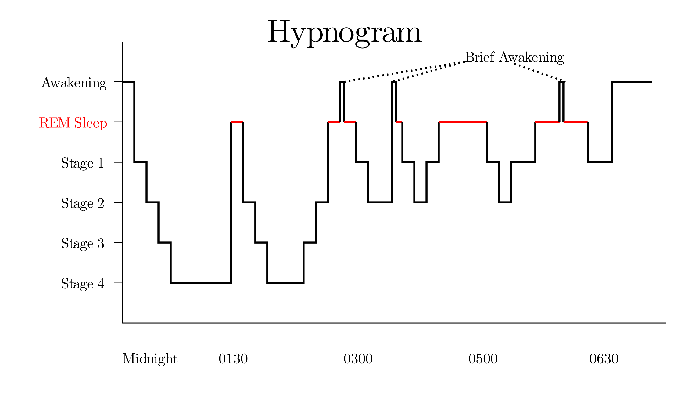

# Introduction
## Historical background

The nature of sleep and its mechanisms and functions has preoccupied the minds of philosophers and scientists for centuries. Various hypotheses have been proposed to explain how sleep affects the brain. As early as 1885, Ebbinghaus found that forgetting is a function of time and, in 1900, M&uuml;ller suggested that new memories are required to be slowly consolidated over time to become resistant against interference and decay [@ebbinghaus1885gedachtnis; @muller1900experimentelle]. In 1924 the first evidence for a potential relationship between sleep and memory consolidation was reported by Jenkins and Dallerback, who argued that there was a noticeable difference between the forgetting rate of individuals who slept and those who stayed awake [-@jenkins1924obliviscence]. Since then, numerous studies have suggested that sleep plays a pivotal role in memory consolidation [@buzsaki1989two; @buzsaki1996hippocampo; @plihal1999effects; @mednick2003sleep; @walker2003sleep; @born2006sleep; @korman2007daytime; @marshall2007contribution; @rasch2007maintaining; @diekelmann2010memory; @lau2010daytime; @chatburn2014complex]. \par
In order to develop a more complete understanding of the relationship between sleep and memory, one must gain information regarding the systems of memory, the mechanisms of memory formation, as well as the characteristics and mechanisms of sleep.

## Systems of memory

Memory systems have been categorized into declarative and non-declarative memory (also known as procedural memory) [@squire1992memory]. This dichotomy is a widely used distinction in neuropsychological and cognitive studies of memory. In addition, some researches have introduced emotional memory as a separate type of memory system [@cahill1995amygdala]. However, for the purpose of the current thesis project, I will introduce and investigate only declarative and non-declarative memory. \par

### Declarative memory

Declarative memory describes the retention of, usually personal, events (episodic memory) and, usually general, facts and information (semantic memory) [@tulving1985classification]. Encoding of these types of memories is rapid, typically explicit, and short- and intermediate-term retrieval depends on the medial temporal lobe, predominantly the hippocampus. Further, declarative memories are highly susceptible to decay, interference and forgetting [@marshall2007contribution]. Although a link between the medial temporal lobe and declarative memory had been suggested more than a century ago [@von1900demonstration], Brenda Milner with the famous case of H.M. --an epileptic patient who became amnesic following the bilateral removal of hippocampi to alleviate his seizures--, documented a clear relationship between the loss of the medial temporal lobes and a severe impairment in declarative memory. As a consequence of his surgical operation, H.M. suffered from anterograde and temporally graded retrograde amnesia, but his perceptual and cognitive abilities, as well as his motor skills remained intact [@scoville1957loss; @milner1972disorders]. The work on H.M., and numerous neuropsychological studies on other amnesic patients confirmed the importance of hippocampal functioning for both the encoding and subsequent retrieval of declarative memories [@eichenbaum2004hippocampus]. \par

### Non–declarative memory

Non-declarative memory, also known as procedural memory, essentially describes the memories for perceptual stimuli, stimulus-response learning, and the acquisition of motor skills (e.g., playing a violin, athletic sports, etc.). Motor skills are broadly classified into motor sequence learning (e.g., learning a piano scale) and motor adaptation (learning to use game controller) [@spencer2017sleep]. Generally, non-declarative memory encoding can involve both explicit and implicit processes and the encoding and retrieval heavily rely on cortico-striatal and cortico-cerebellar loops. Within this memory system, the acquisition of skills is gradual and requires repeated practice; however, once automated, they remain relatively stable over time [@marshall2007contribution].\par

It should be noted that the neuroanatomical description of brain systems involved in the encoding and storage of declarative and non-declarative memories provided above is an over-simplification; as such, it does not capture the complexity and considerable overlap in the neuroanatomical networks that likely participate in the different types of memory. For instance, some fMRI studies have reported that the hippocampus is active during both explicit and implicit motor skill learning [@schendan2003fmri].\par  
<!-- I need to find more studies showing that hippocampus is involved in non-declarative memory -->

## Sleep architecture

<!-- Though in both sleep and coma, we are facing an impairment in conscious awareness, the distinction between sleep and coma is reversibility. Sleep is a transient, periodic, and reversible phenomenon. Therefore, we can define human sleep as an altered state of consciousness with different controls, rhythms, emotions, and dreams [@chokroverty2017overview].

**NEEDS PARAPHRASE**
Consciousness requires two components: awareness (function of cerebral cortex) and
arousal (function of ascending reticular activating system).
Sleep differs from unconscious state or coma (a pathological
state) in the following manner: Sleep besides being a reversible
physiological state also shows differences from coma in
terms of brain metabolism and circulation which show
marked depression and impairment in coma but slight alterations
in sleep.

I DON'T KNOW WHETHER THIS IS REQUIRED OR NOT -->
Historically, sleep was defined through comparison with vegetative states, with the main difference that sleep is rapidly reversal, while vegetative states are not [@DiPerri2017]. In contrast, modern sleep research emphasizes that sleep is an active process characterized by complex, dynamic processes in the nervous system and throughout the body, particularly with regard to the brain's electrical activity during sleep [@chokroverty2017overview]. Here, I follow this modern view of sleep and will explain the process of sleep and sleep architecture, with an emphasis on the electrical activity of the neocortex, as measured by the electroencephalogram (EEG). \par

Prior to the onset of sleep (or stage 1, as will be defined later), behaviours such as slowness of movements and dropping of the eyelids, as well as the clouding of the sensory perception (i.e., the inability to attend to and process sensory information) often indicate fatigue and the imminent onset of sleep. During this state of sleepiness, the EEG typically displays prominent alpha oscillations (8–13 Hz), particularly in the more posterior cortical regions (e.g., occipital lobe).
Sleep itself is comprised of cyclic occurrences of rapid eye movement (REM) sleep and non-REM (NREM) sleep.
NREM sleep accounts for 75-80% of total sleep time in adults. Traditionally, NREM sleep has been divided into four stages: lighter sleep stages 1 and 2, and slow wave sleep (SWS) or stages 3 and 4 [@hobson1969manual]. In the recent scoring manual of the American Academy of Sleep Medicine (AASM), based on EEG criteria, NREM sleep is divided into three stages (N1, N2, and N3) [@iber2007aasm]. Typically, N1,N2, and N3 or SWS will take up 3–8%, 45–55%, and 15–23% of total sleep time respectively [@chokroverty2017overview]. Sleep scoring (i.e., the determination of the current sleep state) is carried out over consecutive time epochs (usually 30 s duration/epoch) and uses information from the EEG, the electromyogram (EMG), and the electrooculogram (EOG). \par

With the onset of sleep, the sleeper enters stage 1 NREM sleep, characterized by a sharp reduction or loss of alpha activity, the appearance of lower amplitude beta activity (12–20 Hz) and some theta waves, which are between 4 to 7 Hz. During this stage, muscle tone decreases and slow, rolling eye movements appear in the EOG. After about 10–12 minutes of N1, the appearance of sleep spindles (11–16 Hz) and K-complexes indicate the onset of stage N2 sleep. Electrophysiological activity of stage 2 NREM shows a gradual increase in slow delta waves (0.5–2 Hz) and theta waves that together occupy less than 20% of an epoch [@chokroverty2017overview]. \par

Finally, the last stage of NREM sleep, or SWS typically begins after 30–60 minutes of N2. Within this stage, slow waves (theta and delta activity, and slow oscillations) comprise 20–100% of an epoch. After a brief interruption by stage 2 NREM, the first REM sleep appears roughly 60–90 from sleep onset. EEG activity during REM sleep consists of low-amplitude beta waves mixed with a small amount of theta oscillations [@chokroverty2017overview]. In the first part of the night, humans undergo high amounts of SWS, whereas REM sleep prevails during the second half of the night. A typical example of the progression of human sleep stages during the course of the night is shown in \autoref{hypnogram}. \par

```{r, fig.cap = "\\textit{A sample hypnogram depicting changes in sleep stages over the course of a typical night of human sleep. Note the predominance of slow wave sleep (stages 3 and 4) during the first half of the night, while the second half contains a large amount of REM sleep.}. \\label{hypnogram}",out.width='70%', fig.align="center", echo=FALSE}

``` 

## Mechanisms of memory consolidation

In their comprehensive review of the memory functions of sleep, Born and Diekelmann claim that during the process of *consolidation*, newly acquired and initially liable memories encoded during wake are transformed into more stable representations that become integrated into the network of pre-existing long-term memories [@diekelmann2010memory]. This consolidation process involves the active re-processing (“replay” or “reactivation”) of new memories in the neural networks that were involved in the encoding process. Given the ‘off-line’ nature of sleep, this state provides an efficient environment for the brain to re-process information, partially due to the reduction in interference by incoming (“online”) sensory information during sleep. Some researchers have proposed that, in addition to saving energy and restorative functions, the memory functions of NREM sleep might be the ultimate evolutionary explanation of the lack of consciousness associated with most sleep stages [@kavanau1997memory]. \par

### Two–stage model of memory consolidation

The current understanding of memory consolidation conforms to Hebb’s second postulate, more informally known as "neurons that fire together, wire together" [@hebb1949organization]. Hebb contended that neurons activated at the same time will form a connected group (cell assembly) that will continue to fire together upon future stimulation with the initial trigger [@wilson2001encyclopedia]. \par

Within this framework, the consolidation process relies on the offline re-activation of neural circuits that were activated during the encoding of information during wakefulness. This process facilitates both the gradual redistribution and reorganization of memory representations to sites for long-term storage (also known as two-stage model of memory consolidation), and the enduring synaptic changes that are necessary to stabilize memories. Several studies have reported that these processes do occur during SWS [@diekelmann2010memory; @buzsaki1989two; @buzsaki1996hippocampo]. For example, Buzsaki [-@buzsaki1989two] reported that during exploratory behaviours (linked to theta activity in the hippocampus) of rats, fast-firing granule cells transform the newly encoded information from the neocortex to a subgroup of CA3 pyramidal cells of the hippocampus. By the end of exploratory behaviour, those subgroup of pyramidal cells initiate a population burst. He suggested that excitatory drive, provided by factors such as sharp wave bursts during either immobility and SWS causes the long-term potentiation in both initiator regions of CA3 and the target CA1 of hippocampus. Thus, Buzsaki argued that the stages of exploratory behaviour (and the concurrent theta activity) and subsequent rest/sleep (with sharp wave activity) both are essential for memory formation.
 
  
Two hypotheses have been proposed to explain the underlying mechanisms of memory consolidation: synaptic homeostasis and active system consolidation.\par

#### Synaptic homeostasis

This model assumes that memory consolidation is a by-product of the global synaptic downscaling happening throughout sleep. The synaptic homeostasis hypothesis postulates that learning during wake leads to progressively greater saturation of the strength of synaptic connections. Thus, the main role of sleep is to re-normalize these synaptic weights. The re-normalization process occurs in synaptic circuits that are less activated, or which already exhibit weaker connectivity within a neural networks; these synapses will undergo depression (i.e., synaptic weakening) during sleep, thus balancing out synaptic potentiation that occurs during learning and maintaining overall networks connectivity and strength within an optimal, non-pathological range [@tononi2014sleep]. Downscaling is thought to occur preferentially during NREM sleep as a result of low levels of neuromodulators in the cortex combined with the synchronous action of electrophysiological events such as sleep spindles, sharp wave-ripples and slow waves [@chatburn2014complex]. It must be noted that all of these events have also been suggested to mediate synaptic potentiation.

#### Active system consolidation

Originating from the dual process hypothesis, the active system consolidation hypothesis argues that events during waking are encoded in both neocortical and hippocampal networks [@rasch2007maintaining]. During SWS, synchrony of thalamo-cortical spindles and hippocampal sharp wave-ripples, induced by the slow oscillation of neocortex, causes the reactivation of representations stored in the hippocampus. Through synchronizing these events, ripple-spindle events are formed, which enable the transfer of the re-activated information from the hippocampus to the neocortex, allowing for a more stable, long-lasting storage of information. The role of sleep in these processes is thought to be crucial, since it provides an optimal state for the re-activation, transfer, and storage of those newly acquired memories into pre-existing knowledge networks [@chatburn2014complex].
<!-- Hans has made some comments in this section that I did not understand. I need to get back to this part again and figure it out -->
It should be noted that these two hypotheses -- synaptic homeostasis and active system consolidation -- are not mutually exclusive and they may act together for the optimal consolidation of acquired information.


### Sleep and Memory consolidation

#### Is it possible to study sleep stages separately?

Historically, most studies on the memory functions of sleep focused on REM and employed REM sleep deprivation procedures to determine how a lack of this sleep stage alters memory consolidation. Using this approach, Greiser and her colleagues found that participants deprived of REM sleep exhibited poor performance in recalling words, compared to NREM sleep-deprived participants [@grieser1972adaptive]. In another study, researchers found that in REM-deprived individuals, recall of perceptual learning is significantly less compared to those who were SWS-deprived [@karni1994dependence]. However, techniques involving sleep deprivation/restriction have some drawbacks, given that repeated awakenings causes stress, which itself exerts adverse effects on memory functions [@born2000rem]. Thus, some recent investigations have involved pharmacological suppression of certain stages of sleep [@rasch2009pharmacological], while others have exploited the natural dominance of specif sleep stages across the night and assigned participants to early or late night sleep schedules to facilitate greater amounts of SWS or REM sleep, respectively [@wagner2001emotional]. It must be noted that each techniques has its own drawbacks, and researchers must be wary of indirect effects or confounding factors when interrupting the results obtained with these different experimental strategies. \par

#### Influences of sleep stages on memory consolidation

Initially, it was thought that declarative memories are consolidated during SWS, whereas REM sleep is associated with the consolidation of non-declarative memories [@plihal1999effects].
This distinction is in accordance with the *dual process hypothesis*, which claims that SWS facilitates hippocampus-dependent (declarative) memories, whereas REM sleep supports hippocampus-independent (non-declarative) memories [@plihal1999effects]. However, further studies showed that SWS can also improve non-declarative memory [@aeschbach2008role], and that REM sleep can improve declarative memory as well [@rauchs2004consolidation; @fogel2007dissociable]. To explain these findings, the *sequential hypothesis* argued that optimum benefits for the consolidation of both memory systems occur when SWS and REM sleep occur is succession [@giuditta1995sequential]. \par
Eventually, Diekelmann & Born (2010) summarized evidences that 'intermediate sleep' stages can also contribute to memory formation [@datta2000avoidance; @nader2003role]. For instance, Rasch and his colleagues [-@rasch2009pharmacological] reported that suppression of REM sleep in humans resulted in an increase in NREM sleep stage 2 activity, which in turn, produced unexpected improvements in procedural memory tasks. Altogether, Diekelmann & Born conclude that the mechanisms of memory consolidation are not strictly associated with certain stages, and in fact may be shared by different stages of sleep. \par 


#### Are we ‘gaining’ during sleep?

The literature on sleep and memory suggests that sleep “strengthens” the association between stimuli stored in memory systems and changes general memory representations. However, it is of importance to distinguish between memory ‘stabilization’ and ‘enhancement’. According to Born and Diekelmann (2010), *stabilization* refers to the resistance to interference from another similar task, whereas *enhancement*, or improvement of performance, happens at re-testing, in the absence of additional practice during the retention interval. \par
In a study by Mednick and her colleagues (2003), memory retention on a procedural task after a 60–90 minutes nap containing either SWS or SWS+REM were compared. They reported that 60 to 90 minutes naps with both SWS and REM sleep produced significant improvements in memory retention, whereas naps without REM sleep were not associated with memory improvements. Participants in the no-nap group performed significantly worse than those in either of the nap groups. In other words, naps with SWS but no REM sleep reversed the deterioration of memory, but did not produce actual improvements. Therefore, the authors suggested that SWS may serve to stabilize performance, while REM sleep may actually induce performance improvements [@mednick2003sleep]. Nonetheless, the debate regarding the precise role of different sleep stages in the stabilization and improvement of memory retention continues to date.\par

### Advantages of nap over nightlong sleep experiment designs

It is of interest to note that, although significant consolidation benefits have been observed after an 8-hour night of sleep [@walker2008cognitive], a number of studies have now demonstrated similar effects on both declarative and procedural memory with much shorter sleep episodes, such as daytime naps (often between 20–60 minutes) [@plihal1997effects; @mednick2003sleep; @tucker2006daytime; @korman2007daytime; @axmacher2008ripples; @ficca2010naps; @lau2010daytime]. \par
Studying the role of short naps on memory functions offers several advantages (but also disadvantages) when compared to investigations of overnight sleep. Given that naps typically are too short for the sleeper to enter REM sleep, they provide an opportunity for isolating the effects of NREM sleep. Further, since participants in a nap experiment generally learn and are re-tested at more similar time of the day (e.g., in the afternoon), potential influences of circadian effects on learning and performance are minimized [@lau2010daytime]. Finally, nap experiments conducted during the day avoid the need to keep participants awake overnight and, therefore, reduce the acute effects of prolonged sleep deprivation on performance. \par
The beneficial effects of napping on memory consolidation are not limited to healthy individuals. In one study, researchers found that the benefits of napping on the consolidation of declarative memory is observable in patients with schizophrenia and moderate-to-major depression [@seeck2010effects]. In conclusion, napping can be utilized as a valid alternative to overnight sleep for experimental studies that probe the effects of sleep on learning and memory.\par

While the role of sleep in memory consolidation is well-established, it is less clear if sleep plays a modulatory or supportive function, or whether it is truly criticial for consolidation to take place. Further, the potential role of different types of waking states in consolidation has not been examined in great detail. For example, it is possible that there are some discernible components of sleep that are also present, at least to some degree, during wakefulness and that may promote consolidation during non-sleep states (e.g., relaxation, quiet wakefulness, motor inactivity, reduced sensory processing and interference). To investigate the question of whether some states of waking can effectively promote consolidation, we chose to study if meditation, as a state of wakefulness characterized by quiescence and reduced sensory interference, can affect the consolidation of declarative and non-declarative memories. \par

## Meditation


### Definition and variations 

Meditation can be defined as a form of mental training, with the aim of improving core psychological capacities (i.e. attentional and emotional self-regulation) [@tang2015neuroscience]. A variety of complex practices are classified as meditation, such as mindfulness, mantra meditation, yoga, tai chi, and chi gong. Among those practices, *mindfulness meditation* has been studied extensively over the past two decades [@tang2015neuroscience].


### Mindfulness meditation

 Originating from Buddhism around 5th century BC, mindfulness meditation has its roots in Hindu culture, dating back to the 3rd millennium BC. According to Zeidan et al.[-@zeidan2010mindfulness], mindfulness meditation focuses on the sensations of the breath/body while maintaining a relaxed state of mind. In other words, mindfulness meditation requires both “the regulation of attention and the ability to approach one’s experience with openness and acceptance” [@tang2015neuroscience].
 It has two common features: *focused attention* and *open monitoring*. Most forms of mindfulness meditation practices begin with “a period of focused attention on a target” (i.e., breath) to focus awareness, which is followed by “the more receptive state of open-monitoring” [@lomas2015systematic]. In addition to personal practice, variations of mindfulness meditation have been employed for various clinical interventions as well, such as Integrative body-mind training (IBMT) and the Mindfulness-Based Stress Reduction (MSBR) program, which has been prescribed as part of the treatment of a variety of mental health conditions [@kabat1982outpatient; @tang2015neuroscience]. 

#### Mindfulness and memory

With regards to memory, Brown and his colleagues [-@brown2016mindfulness] defined mindfulness as a specific type of attention. They proposed that meditation, by enhancing the quality of attention, improves the quality of encoding with more fidelity into working memory. It is widely accepted that working memory is necessary for long term memory (LTM) formation for declarative information [@brown2015mindfulness]. Additionally, it is known that both attention and working memory improve the LTM.

In research settings, mindfulness practitioners have generally been divided into dispositional mindfulness (i.e., trait mindfulness) and deliberate (intentional) mindfulness meditation. Mindfulness meditation temporarily changes the condition of the brain and its corresponding pattern of activity or connectivity (state change), and can eventually alter more stable personality traits following longer periods of practice [@tang2017traits].

#### Neural oscillations of mindfulness

Some of the electrophysiological characteristics of meditation resembles certain aspects of sleep, such as the decrease in high-frequency (beta, gamma) EEG activity, together with an increase in the theta-alpha range (4–12 Hz) [@shaw1996intention; @lagopoulos2009increased; @lomas2015systematic; @dentico2018acute].
In the human EEG, alpha activity (8–12 Hz) is a prominent activity pattern over the central and posterior (occipital) cortex, which is typically present during periods of relaxed immobility and eye closure [@chokroverty2017overview]. Further, increased activity in the theta range (3.5–7.5 Hz) is another diagnostic oscillation of a meditative state. Previous research has reported a positive correlation between EEG theta power and the level of meditation experience [@kasamatsu1966electroencephalographic; @aftanas2001human]. Further, a comparison of monks and novice meditators during Zen meditation has shown that alpha activity increases across all groups during meditation, whereas increases in theta activity were proportional to the level of meditative experience [@murata1994quantitative]. In sum, the co-presence of alpha and theta activity can be used as an index of *relaxed alertness* and meditative states [@lomas2015systematic].

## Quiet rest

Quiet rest is an instance of non-sleep states, which has been shown to enhance memory retention [@born2006sleep]. Brokaw and her colleagues [-@brokaw2016resting] proposed that
similar to sleep, quiet rest could facilitate memory formation using active consolidation mechanisms. Some studies have demonstrated that during quiet rest in humans, hippocampal sharp-wave ripples, an indicator of reactivation, were prevalent [@axmacher2008ripples; @clemens2011fine]. In addition, increases in alpha, theta, and delta (0.5–2 Hz) activity was observed in quiet rest [@brokaw2016resting]. Taking this into consideration, quiet rest may also serve as a valuable non-sleep-related state for studies assessing the potential role of various types of wakefulness in memory consolidation. \par

In summary, although the role of sleep in memory formation is well-established, the contribution of different types of wakefulness (i.e., active, quiet) is not clear. Thus, this study examined napping and two types of wakefulness, and how they might contribute to the consolidation of declarative and non-declarative memories in humans.

## Aims of the current study

The overall goal of this study was to examine whether sleep and some non-sleep-related behavioural states influence memory consolidation in humans. Further, I examined whether some shared physiological (particularly EEG) components of sleep and waking are related to the effectiveness of different behavioural states to influence memory consolidation. I hypothesized that participants in the napping and meditation groups will perform better than those in the wake condition on tasks assessing both declarative and non-declarative memory.

\newpage
# References
\setstretch{1.5}