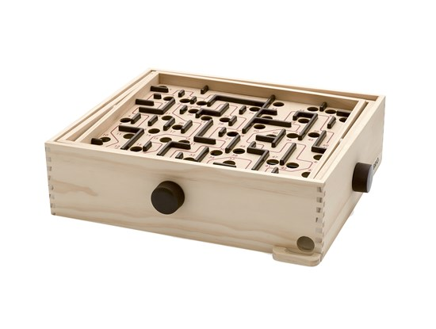
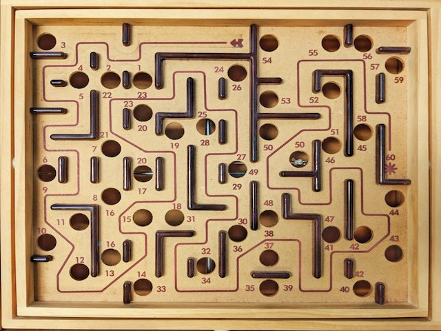

```{r setup, include=FALSE}
RAW_Dec_2018 <- rio::import('https://github.com/mohdasti/Queens-Thesis/blob/bff30a97de4611da7172295f0b25c090770e41ab/Oct%202018.xlsx?raw=true', na="N/A")
```

# Methods
## Study Design 

This study followed of a pilot experimet, performed by Asvini Kulanayagam, a former student of Sleep & Neuroplasticity lab at Queen's University for her Honours Thesis. Although the majority of data used in the current study have been collected across two-years of my Master's studies, I have benefited from some of the results of the pilot experiment. \newline
This study comprised of two main parts: The *Initial interview* and the *Experiment*. It was beneficial for participants to familiarize themselves with the study and testing environment before commencing the main experiment. Thus, during the initial interview, the researcher showed the facility to participants, and asked them to sign the Letter of Information and Consent, the Participant Information Survey and the “Freiburg Mindfulness Inventory” [@walach2006measuring] (See Appendix C, D, E). Based on the participant’s responses and history of activities, the researcher assigned him/her to one of the three experimental conditions (random assignment for napping/wake conditions). \par

All experimental procedures were conducted between 2:00 to 7:00 p.m. Participants arrived at the Sleep Laboratory, completed the “Epworth Sleepiness Scale”[@johns1991new], then were assigned to start with the paired associates (word-pair) task to assess declarative memory, and the marble maze task to assess non-declarative memory (all post-treatment tasks are completed in a counterbalanced order). After completing the training tasks, then participants were prepared for the electroencephalography (EEG), electro-oculography (EOG), and electromyography (EMG) recordings and informed of their assigned condition (meditation, nap, wake). Following the completion of the electrode set-up and calibration procedure, participants spent 60 minutes in a quiet room. For the wake condition, participants watched the documentary movie “Planet Earth” [@Fothergill2007] on a computer screen. Participants in the meditation condition were asked to complete a self-guided meditation session, and for the nap condition, they were instructed to sleep in the bed. During this period, subjects’ brain activity was monitored with polysomnography. \par

After the hour-long treatment, the researcher informed the participant that the hour is completed. After removing the electrodes, depending on their treatment condition, participants completed a self-report on the quality of their activity in the room, and a post-treatment ESS questionnaire (See Appendix F, G, H, I). Subsequently, they were asked to complete 50 trials of the maze task and the word-pair recall test. At the end, participants were debriefed (see Appendix J) and given monetary compensation. The overall study design is illustrated in \autoref{timelinelabel}.


```{r, fig.cap = "Timeline Diagram Illustrating the Study Design. FMI = Freiburg Mindfulness Inventory. ESS = Epworth Sleepiness Scale. \\label{timelinelabel}", fig.pos = 'h', echo=FALSE}
knitr::include_graphics('Figures/timeline.pdf')
```

## Participants
Participants were recruited from Queen’s University Psychology subject pool, advertised posts on the Queen’s University paid research studies Facebook group, posters displayed on campus and yoga studios of downtown Kingston, or word-of-mouth (see Appendix A). To be eligible for the study, participants should be between the ages of 18 and 65, with no previous diagnosis of psychiatric, neurological, or sleep disorders, and should not take sleep medications. Some specific inclusion criteria included the following: participants must nap for an average of three times a week over the last three weeks to be included in the nap condition; participants must practice meditation for an average of at least three times a week to be included in the meditation group. All participants received \textsc{cad\$25} monetary compensation for the completion of the 3 hours study, with the exception of participants from Psychology 100 and 200 subject pools, who received a course credit plus \textsc{cad\$10} for their participation. The study is approved by the Queen’s University general ethics research board (See Appendix B). After the initial interview and checking for inclusion criteria, a total of `r nrow(RAW_Dec_2018)` completed the study. However, <!-- add Asvini's work into that and check for those who f-ed the experiment --> failed to meet the experiment critrtia (e.g. participants who dozed off during the meditation session), leaving us with <!-- final number --> of participants.


## Materials
### Memory tasks

Declarative memory was assessed by a Paired Associate (Word-Pair) task. Using an online random noun generator and Microsoft Power Point, random word pairs are generated and displayed to participants.  During the training slide-show, a total of 60 word-pairs are displayed for 5 seconds each, with a 5 seconds inter-stimulus interval (\textsc{isi}) (blank slide with a central fixation point). The researcher asked participants to remember as many word-pairs as they can. Following the treatment condition, subjects were shown a new set of slides consisting of 20 word-pairs that were presented during the initial training session, 20 word-pairs that were novel combinations of words presented during the initial training session, and 20 word-pairs that were completely new to participants. During the test session, participants were asked to respond “yes” or “no” to the word-pairs: “yes” for a word-pair that they saw in the training session, and “no” for any combination that was different from training session. \par

Non-declarative (procedural) memory was assessed using the *Marble Maze* visuo-motor task \autoref{marblemaze}, which involves two knobs on the right and lower side used for controlling the tilt of the surface [@brio]. The goal of the task is to pass a small marble along the lined path by turning the knobs. The score on each trial is determined by the number of the hole that the marble falls into, with higher scores indicating better performance and superior manual dexterity. The plate, in which marbles ran through can been on \autoref{marblemazeabove}. The training and test session involved of 100 and 50 trials, respectively. To maximize the effort of the participants, the researcher asks them to take a break at the mid-point of the training session (i.e., after 50 trials), as well as introducing an incentive (e.g., gift card) to the participant obtaining the highest score.
	
```{r, fig.cap = "Brio Labyrinth Marble Maze game used as a visuomotor task to assess the procedural memory. \\label{marblemaze}",out.width='100%', fig.align="center", echo=FALSE}

``` 

```{r, fig.cap = "Plate of the game from above. \\label{marblemazeabove}",out.width='70%', fig.align="center", echo=FALSE}

``` 

### Self-report measures
The Freiburg Mindfulness Inventory (FMI), a 14-item assessment, is administered to evaluate the experience of mindfulness in experienced, novice, and non-meditators. Scores range from 14 to 56, with higher scores indicating a greater degree of mindfulness [@walach2006measuring]. In this study, the \textsc{fmi} is employed to capture the participants’ ability to engage in a “mindful” state (see Appendix E). \newline
The Epworth Sleepiness Scale (ESS) is an 8-items questionnaire that measures general daytime sleepiness by assessing the subject’s self-reported tendency to fall asleep in various situations of daily life. A higher the \textsc{ess} score is indicative of a great level of sleepiness [@johns1991new]. In this study, the \textsc{ess} is employed to measure sleepiness before and after the treatment (see Appendix I). \par

In addition to these standardized questionnaires, participants are asked to fill out a condition-related self-report. Meditators report if they meditated, as well as the length and the quality of their meditation session on a scale of 1 to 5, with higher numbers indicating greater quality. In a similar format, participants in napping condition reported their sleep quality, and people in wake condition reported whether they fell asleep while watching the movie (see Appendix F, G, H).

## Apparatus
### Electrode placements and recordings

Polysomnography was recorded employing standard procedures, as follows: \textsc{eeg}: O1-F7, O2-C4, according to the 10-20 system, with bilateral mastoid references; \textsc{eog}, right and left outer canthus, with the bridge of the nose as reference; and \textsc{emg} recorded at the chin for assessing jaw muscle tone. \autoref{eegcaplabel} shows the schematic illustration of \textsc{eeg} electrode placements. All signals were recorded using the software package Chart (v. 5, AD Instruments, Toronto, Ontario). Recordings were visually scored according to standard criteria by a trained rater under blind conditions [@sleep2001proposed].
``` {r include=FALSE}
ipak2 <- function(pkg){
  new.pkg2 <- pkg[!(pkg %in% installed.packages()[, "Package"])]
  if (length(new.pkg2)) 
    install.packages(new.pkg2, dependencies = TRUE)
  sapply(pkg, require, character.only = TRUE)
}
packages <- c("eegkitdata","bigsplines","quadprog","ica","signal","rgl",
              "eegkit")
ipak2(packages)
```

``` {r, fig.cap = "Schematic representation of employed electroed in the 10-20 system. \\label{eegcaplabel}", echo = FALSE }

myelectrodes <- rep("light blue",24)
enames <- c("A1", "A2", "FP1", "FP2", "FPZ", "F7", "F3", "FZ", "F4", "F8", "NZ",
            "T7", "C3", "CZ", "C4", "T8", "P7", "P3", "PZ", "P4", "P8", "O1",
            "O2", "OZ")
myelectrodes[enames=="A1"] <- "red"
myelectrodes[enames=="A2"] <- "red"
myelectrodes[enames=="C4"] <- "red"
myelectrodes[enames=="F7"] <- "red"
myelectrodes[enames=="O1"] <- "red"
myelectrodes[enames=="O2"] <- "red"

eegcap(electrodes = "10-20", col.point = myelectrodes)
```

### Measures of sleep

The amount and duration of the following parameters were computed: number of arousals, sleep onset latency, Stage 1 sleep, Stage 2 sleep, slow wave sleep (\textsc{sws}), and total sleep time. For participants in the wake and meditation condition, the \textsc{eeg} was reviewed to confirm that sleep did not occur. <!-- talk more about the visual scoring of sleep in the paper I just found -->

### Measures of meditation
For meditators, spectral analysis using fast Fourier transform was applied to assess the mean power spectral density in the frequency bands of interest (0.5-50 Hz). <!-- this section needs to be completed with the data gathered from R -->

# References

